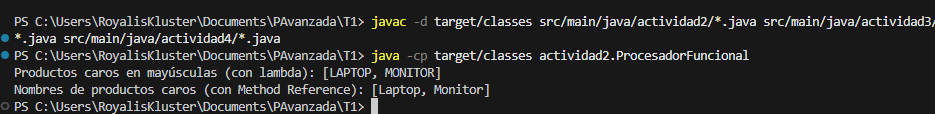
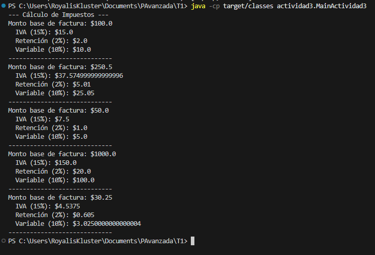
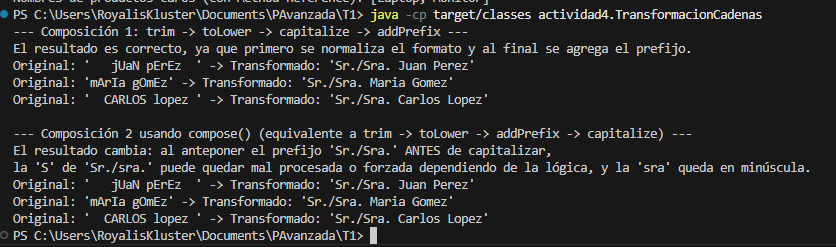

# Tarea 1: Programación Funcional

Este repositorio contiene la solución a las actividades prácticas 2, 3 y 4 de la Tarea 1 de Programación Funcional.

## Requisitos
- **Java**: 17 o superior
- **Maven**: 3.6 o superior

## Instrucciones para compilar y ejecutar

Puedes ejecutar cada una de las actividades utilizando Maven desde la terminal en el directorio raíz del proyecto (`T1/`):

1. **Compilar el proyecto:**
   ```bash
   mvn clean compile
   ```

2. **Ejecutar Actividad 2 (Refactorización a programación funcional):**
   ```bash
   mvn exec:java -Dexec.mainClass="actividad2.ProcesadorFuncional"
   ```

3. **Ejecutar Actividad 3 (Interfaz Funcional Propia):**
   ```bash
   mvn exec:java -Dexec.mainClass="actividad3.MainActividad3"
   ```

4. **Ejecutar Actividad 4 (Composición de funciones):**
   ```bash
   mvn exec:java -Dexec.mainClass="actividad4.TransformacionCadenas"
   ```

### Alternativa sin Maven (Usando `javac` y `java`)

Si no tienes Maven instalado, puedes compilar y ejecutar usando Java directamente desde la carpeta `T1/`:

1. **Compilar el proyecto:**
   ```bash
   javac -d target/classes src/main/java/actividad2/*.java src/main/java/actividad3/*.java src/main/java/actividad4/*.java
   ```

2. **Ejecutar Actividad 2:**
   ```bash
   java -cp target/classes actividad2.ProcesadorFuncional
   ```

3. **Ejecutar Actividad 3:**
   ```bash
   java -cp target/classes actividad3.MainActividad3
   ```

4. **Ejecutar Actividad 4:**
   ```bash
   java -cp target/classes actividad4.TransformacionCadenas
   ```

## Resultados Esperados (Capturas de salida)

Al ejecutar la **Actividad 2**, verás algo como:
```
Productos caros en mayúsculas (con lambda): [LAPTOP, MONITOR]
Nombres de productos caros (con Method Reference): [Laptop, Monitor]
```






